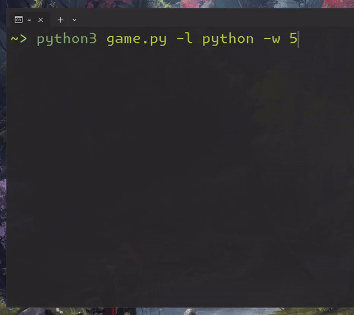

# CodeTab



## Author: 0xans

## Contact: Instagram: [0x.ans](https://instagram.com/0x.ans)

## Usage:

```sh
python codetab.py [-l LANGUAGE] [-w WORDS]
```

## Tool Description:

CodeTab is a Python tool designed to improve your typing speed with random words related to different programming languages. It calculates your words per minute (WPM) and provides real-time feedback on your typing accuracy.

## Options:

- `-h, --help`: Show help message and exit.
- `-l LANGUAGE, --language LANGUAGE`: Specify the programming language to test (e.g., `python`, `c++`,`java`,`js`,`php`).
- `-w WORDS, --words WORDS`: Number of words to test (optional, default is continuous until interrupted).

## Adding New Languages:

To add support for new programming languages:

1. Ensure you have a text file (`language.txt`) containing a list of words related to the language.

2. Add an entry in the `languages.json` file with the language keyword and the file name:

   ```json
   {
       "python": "python",
       "c++": "c++",
       "java": "java",
       "php": "php",
       "js": "JavaScript",
       "your_language_keyword": "language.txt"
   }
   ```

   Replace `"your_language_keyword"` with your chosen keyword and `"language.txt"` with the actual filename.

## Example Usage:

**To test typing with Python words for 100 words:**

```sh
python codetab.py -l python -w 100
```

**To continuously test typing with C++ words:**

```sh
python codetab.py -l cpp
```

## Contributing:

Contributions are welcome! Please fork the repository and create a pull request with your improvements.

